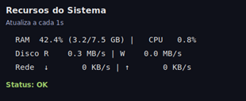

# Machine Monitor (Tkinter + Psutil)

Um mini monitor de recursos do sistema em janela flutuante, feito em Python com `tkinter` e `psutil`.

## Demonstração



## O que ele mostra

- Uso de **CPU** e **RAM** em tempo real
- Taxa de **leitura/escrita de disco** (MB/s)
- Taxa de **download/upload de rede** (KB/s)
- Status geral com alerta visual (`🔥`) quando passa dos limites
- Janela sempre no topo, sem borda, e arrastável com o mouse

## Requisitos

- Python 3.10+ (recomendado)
- Pip
- Dependências do projeto (arquivo `requiriments.txt`)

## Configuração do ambiente

### 1) Clonar o projeto

```bash
git clone <url-do-repo>
cd machine_monitor
```

### 2) (WSL + venv) Instalar suporte ao Tkinter no sistema

Se você estiver usando **WSL** com ambiente virtual (`venv`), instale o pacote do sistema antes de rodar o app:

```bash
sudo apt update
sudo apt install -y python3-tk
```

> Observação: em Linux/WSL, o `tkinter` normalmente vem do pacote do sistema (`python3-tk`), não do `pip`.

### 3) Criar e ativar o venv

```bash
python3 -m venv venv
source venv/bin/activate
```

### 4) Instalar dependências Python

```bash
pip install -r requiriments.txt
```

## Como executar

```bash
python app.py
```

## Personalização rápida

No arquivo `app.py`, você pode ajustar:

- `UPDATE_MS`: intervalo de atualização (ms)
- `CPU_WARN`, `RAM_WARN`, `DISK_MB_S_WARN`, `NET_KB_S_WARN`: limites de alerta
- Cores da interface (`BG`, `FG`, `WARN`, etc.)

## Estrutura do projeto

```text
machine_monitor/
├── app.py
├── assets/
│   └── monitor.png
├── requirements.txt
├── .gitignore
└── README.md
```
